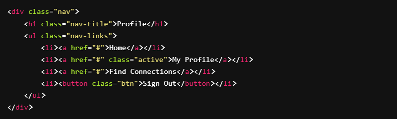

# Flex Navbar

#### Objectives
- Practice using display: flex;
- Practice using align-items and justify-content

Using the following **HTML**

Style it using CSS to resemble the following navigation bar

- [x] Use the supplied HTML code snippet to recreate the image using flex.

- [x] (optional) Use google font Roboto [https://fonts.google.com/specimen/Roboto?preview.text_type=custom]

Here is how mine turned out.

